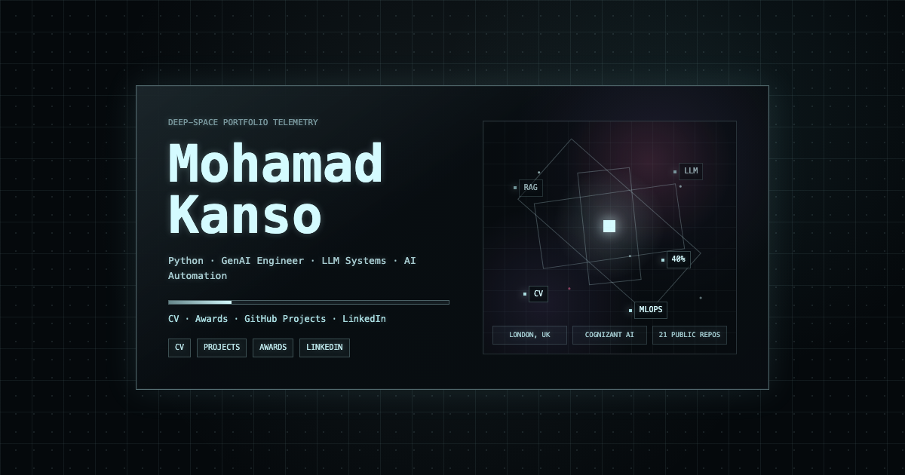

# Mohamad Kanso Portfolio

Interactive terminal-style portfolio for Mohamad Kanso, built for LinkedIn Featured and recruiter review.

## LinkedIn Featured Link

Use this URL in the Featured section:

[https://mohamadkanso.github.io/](https://mohamadkanso.github.io/)

[Open the live portfolio](https://mohamadkanso.github.io/)



## What It Includes

- Downloadable CV
- Awards and recognition
- Dissertation link
- Public GitHub projects and live demos
- LinkedIn and contact routes
- eDEX-inspired interface with a recruiter-friendly portfolio view

## Local Preview

```bash
python3 -m http.server 4173 --bind 127.0.0.1
```

Then open `http://127.0.0.1:4173`.
