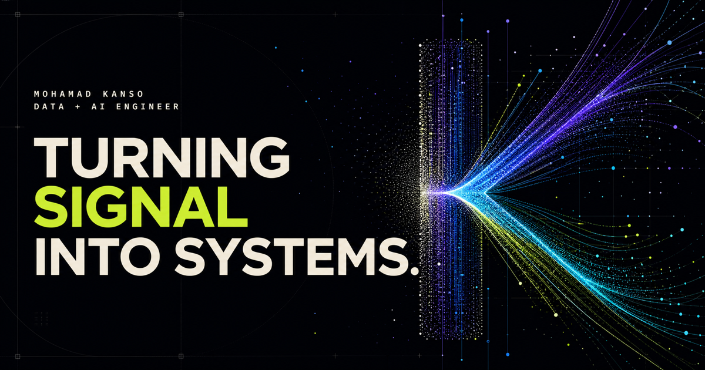

# Mohamad Kanso — Portfolio

[mohamadkanso.github.io](https://mohamadkanso.github.io/) is the portfolio of Mohamad Kanso, a London-based Data and AI Engineer.



## Signal / Noise

The experience is built around a living visual system that turns disorder into structure as visitors move through the work. Project chapters reshape the same signal into workflow graphs, privacy gates, code scans, agent orbits, incident shockwaves and market traces.

The cinematic path is paired with a fast 60-second view, direct CV and contact links, full keyboard support, a reduced-motion mode and a filterable public-project archive.

## Featured work

- WorkflowForge
- VoiceSafeKit
- CodeSentry
- SignalBrief
- IncidentForge
- Odysseus
- MurmurX
- Bitcoin time-series ML dissertation

## Local preview

```bash
python3 -m http.server 4173 --bind 127.0.0.1
```

Open [http://127.0.0.1:4173](http://127.0.0.1:4173).
